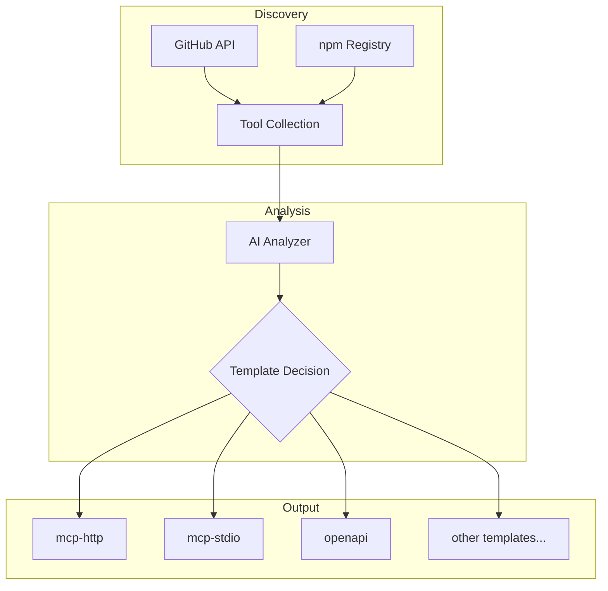

# What is Lyra Tool Discovery?

Lyra Tool Discovery is an AI-powered tool that automatically discovers MCP (Model Context Protocol) servers and tools from GitHub and npm, analyzes them using OpenAI or Anthropic, and determines the best plugin template for integration with SperaxOS.

## The Problem It Solves

Building an ecosystem of plugins for AI assistants requires:

1. **Finding tools** - Searching through thousands of repositories and packages
2. **Understanding tools** - Reading documentation to understand capabilities
3. **Classifying tools** - Determining what type of plugin wrapper to use
4. **Generating configs** - Creating the correct configuration format

Doing this manually for hundreds of tools is tedious and error-prone. Lyra automates this entire process.

## How It Works



1. **Discovery Phase** - Searches multiple sources for MCP-compatible tools
2. **Data Collection** - Fetches README, package.json, and code structure
3. **AI Analysis** - Sends structured data to OpenAI or Anthropic
4. **Template Decision** - AI selects from 8 plugin templates
5. **Config Generation** - Produces ready-to-use plugin configuration

## Who Should Use Lyra?

### Plugin Registry Maintainers
Automatically populate your registry with discovered tools instead of manually adding each one.

### Platform Developers
Integrate Lyra into your CI/CD pipeline to automatically detect and add new MCP servers.

### Tool Authors
Quickly generate the correct plugin configuration for your MCP server.

### Researchers
Analyze the MCP ecosystem to understand what tools are available.

## Prerequisites

- **Node.js 18+** - Required runtime
- **pnpm/npm/yarn** - Package manager
- **AI API Key** - Either OpenAI or Anthropic
- **GitHub Token** (optional) - For higher API rate limits

## Key Features

### 🔍 Multi-Source Discovery
- GitHub repository search
- npm package search
- Extensible source architecture (coming: Smithery, MCP Directory)

### 🤖 Intelligent AI Analysis
- Parses README files for usage patterns
- Analyzes package.json for dependencies and entry points
- Detects MCP SDK usage automatically
- Understands OpenAPI specifications

### 📦 8 Plugin Templates
| Template | Description |
|----------|-------------|
| `mcp-http` | Remote MCP server via HTTP |
| `mcp-stdio` | Local MCP server via STDIO |
| `openapi` | OpenAPI/Swagger spec wrapper |
| `standalone` | Full React application |
| `markdown` | Rich text output |
| `basic` | Simple API endpoint |
| `default` | Plugin with settings UI |
| `settings` | User preferences storage |

### ⚡ CLI and Programmatic API
- Quick CLI commands for immediate results
- Full TypeScript API for integration
- JSON output for piping to other tools

## Architecture

```
lyra-tool-discovery/
├── src/
│   ├── index.ts        # Main ToolDiscovery class
│   ├── ai.ts           # AIAnalyzer (OpenAI/Anthropic)
│   ├── cli.ts          # CLI commands
│   ├── types.ts        # TypeScript definitions
│   └── sources/
│       ├── github.ts   # GitHub API source
│       └── npm.ts      # npm Registry source
└── dist/               # Compiled output
```

## Next Steps

- [Getting Started](/guide/getting-started) - Install and run your first discovery
- [Configuration](/guide/configuration) - Learn about configuration options
- [Plugin Templates](/guide/plugin-templates) - Understand the 8 template types
- [CLI Reference](/cli/) - Full command documentation
