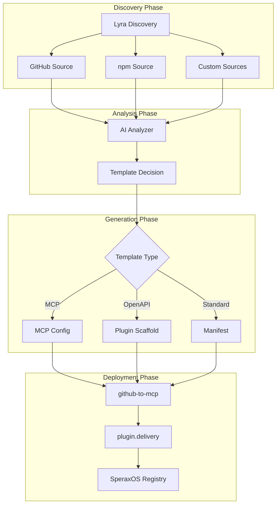

# Pipeline Integration

Lyra Tool Discovery is designed to integrate into larger automation pipelines, feeding discovered tools into downstream systems like github-to-mcp and plugin.delivery.

## Full Pipeline Architecture



## Pipeline Components

### 1. Lyra Tool Discovery (You Are Here)

Discovers and analyzes tools from GitHub, npm, and other sources.

**Input:** Configuration, source settings
**Output:** JSON array of analyzed tools with template decisions

### 2. github-to-mcp

Transforms GitHub repositories into functional MCP servers.

**Input:** Lyra discovery output
**Output:** MCP server implementations

```bash
# Example: pipe Lyra output to github-to-mcp
lyra-discover discover --sources github --limit 5 | github-to-mcp transform
```

### 3. plugin.delivery

Registry and delivery platform for plugins.

**Input:** Plugin manifests and configurations
**Output:** Published plugins accessible to SperaxOS

## Integration Patterns

### Pattern 1: Direct JSON Piping

```bash
# Discover → Transform → Register
lyra-discover discover --sources github,npm --limit 10 \
  | jq '.[] | select(.decision.template == "mcp-stdio")' \
  | github-to-mcp register
```

### Pattern 2: File-Based Pipeline

```bash
# Step 1: Discovery
lyra-discover discover --sources github --limit 20 > discovered.json

# Step 2: Filter and transform
cat discovered.json \
  | jq '[.[] | {name: .tool.name, template: .decision.template, config: .generated.pluginConfig}]' \
  > filtered.json

# Step 3: Register each tool
for config in $(cat filtered.json | jq -c '.[]'); do
  echo $config | github-to-mcp register
done
```

### Pattern 3: Programmatic Pipeline

```typescript
import { ToolDiscovery } from '@nirholas/lyra-tool-discovery';
import { MCPTransformer } from '@nirholas/github-to-mcp';
import { PluginRegistry } from '@nirholas/plugin-delivery-client';

async function runPipeline() {
  // 1. Discovery
  const discovery = new ToolDiscovery({ provider: 'anthropic' });
  const results = await discovery.discover({
    sources: ['github', 'npm'],
    limit: 50
  });
  
  // 2. Filter for MCP tools
  const mcpTools = results.filter(r => 
    r.decision.template === 'mcp-http' || 
    r.decision.template === 'mcp-stdio'
  );
  
  // 3. Transform each tool
  const transformer = new MCPTransformer();
  const transformed = await Promise.all(
    mcpTools.map(tool => transformer.transform(tool))
  );
  
  // 4. Register with plugin.delivery
  const registry = new PluginRegistry({ apiKey: process.env.PLUGIN_API_KEY });
  for (const plugin of transformed) {
    await registry.register(plugin);
    console.log(`Registered: ${plugin.identifier}`);
  }
}
```

## Automation Strategies

### Scheduled Discovery

Run discovery on a schedule to find new tools:

```yaml
# .github/workflows/discovery.yml
name: Scheduled Discovery

on:
  schedule:
    - cron: '0 0 * * *'  # Daily at midnight
  workflow_dispatch:

jobs:
  discover:
    runs-on: ubuntu-latest
    steps:
      - uses: actions/checkout@v4
      
      - name: Setup Node.js
        uses: actions/setup-node@v4
        with:
          node-version: '20'
      
      - name: Install Lyra
        run: npm install -g @nirholas/lyra-tool-discovery
      
      - name: Run Discovery
        env:
          ANTHROPIC_API_KEY: ${{ secrets.ANTHROPIC_API_KEY }}
          GITHUB_TOKEN: ${{ secrets.GITHUB_TOKEN }}
        run: |
          lyra-discover discover \
            --sources github,npm \
            --limit 50 \
            > discovery-results.json
      
      - name: Process Results
        run: |
          # Your processing logic here
          cat discovery-results.json | jq '.[] | .tool.name'
      
      - name: Upload Artifacts
        uses: actions/upload-artifact@v4
        with:
          name: discovery-results
          path: discovery-results.json
```

### Webhook Integration

Trigger discovery on external events:

```typescript
import express from 'express';
import { ToolDiscovery } from '@nirholas/lyra-tool-discovery';

const app = express();
app.use(express.json());

// Webhook endpoint
app.post('/webhook/discover', async (req, res) => {
  const { source, query, limit = 10 } = req.body;
  
  const discovery = new ToolDiscovery();
  const results = await discovery.discover({
    sources: [source],
    limit
  });
  
  // Process results (e.g., send to Slack, create issues)
  await notifySlack(results);
  await createGitHubIssues(results);
  
  res.json({ discovered: results.length });
});

app.listen(3000);
```

### Event-Driven Pipeline

```typescript
import { EventEmitter } from 'events';
import { ToolDiscovery } from '@nirholas/lyra-tool-discovery';

class DiscoveryPipeline extends EventEmitter {
  private discovery: ToolDiscovery;
  
  constructor() {
    super();
    this.discovery = new ToolDiscovery();
    this.setupListeners();
  }
  
  private setupListeners() {
    this.on('tool:discovered', async (tool) => {
      console.log(`New tool: ${tool.name}`);
      this.emit('tool:analyze', tool);
    });
    
    this.on('tool:analyzed', async (result) => {
      console.log(`Analyzed: ${result.tool.name} → ${result.decision.template}`);
      
      if (result.decision.template.startsWith('mcp-')) {
        this.emit('tool:transform', result);
      } else {
        this.emit('tool:scaffold', result);
      }
    });
    
    this.on('tool:ready', async (plugin) => {
      console.log(`Ready to register: ${plugin.identifier}`);
      this.emit('tool:register', plugin);
    });
  }
  
  async run() {
    const results = await this.discovery.discover({ limit: 10 });
    for (const result of results) {
      this.emit('tool:analyzed', result);
    }
  }
}
```

## Data Flow

### Discovery Output Format

```json
{
  "tool": {
    "id": "github:owner/repo",
    "name": "mcp-server-example",
    "description": "Example MCP server",
    "source": "github",
    "sourceUrl": "https://github.com/owner/repo",
    "hasMCPSupport": true
  },
  "decision": {
    "template": "mcp-stdio",
    "reasoning": "npm package with bin entry, uses MCP SDK",
    "config": { /* ... */ }
  },
  "generated": {
    "pluginConfig": {
      "identifier": "mcp-server-example",
      "customParams": {
        "mcp": {
          "type": "stdio",
          "command": "npx",
          "args": ["-y", "mcp-server-example"]
        }
      }
    }
  }
}
```

### Transformation to Plugin Index

```json
{
  "identifier": "mcp-server-example",
  "manifest": "https://plugin.delivery/plugins/mcp-server-example/manifest.json",
  "author": "owner",
  "homepage": "https://github.com/owner/repo",
  "createdAt": "2024-01-15T00:00:00Z",
  "meta": {
    "title": "MCP Server Example",
    "description": "Example MCP server",
    "avatar": "🔧",
    "tags": ["mcp", "tools"],
    "category": "utilities"
  }
}
```

## Next Steps

- [GitHub Actions](/guide/github-actions) - Detailed CI/CD setup
- [Examples](/examples/batch-processing) - Batch processing examples
- [API Reference](/api/) - Programmatic integration
