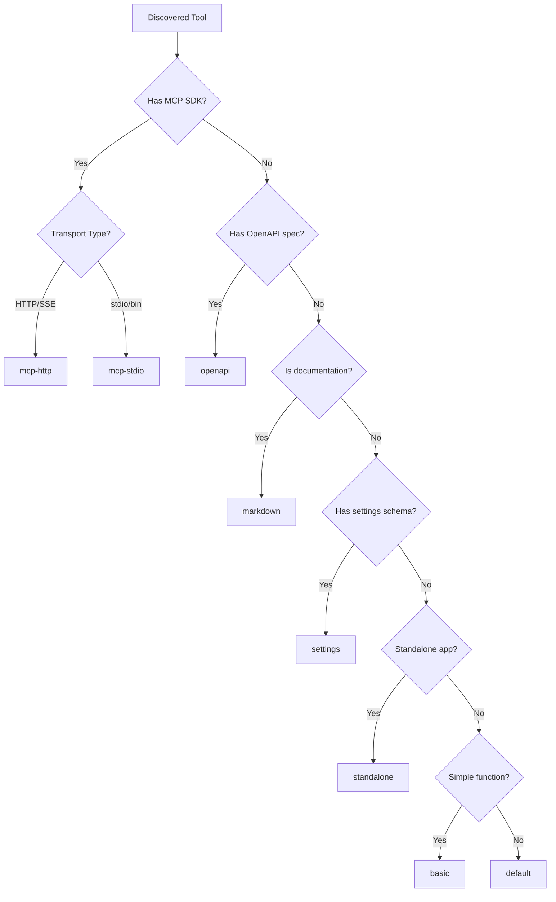

# Plugin Templates

Lyra Tool Discovery supports 8 plugin templates from the plugin.delivery ecosystem. Each template serves a specific use case and has different requirements. This guide provides comprehensive documentation for selecting and configuring the right template for your tool.

## Template Overview

| Template | Transport | Typical Use Case | Complexity |
|----------|-----------|------------------|------------|
| `mcp-http` | HTTP/SSE | Remote MCP servers | Medium |
| `mcp-stdio` | stdio | Local MCP servers | Medium |
| `openapi` | HTTP | REST APIs | Low |
| `basic` | Function | Simple utilities | Low |
| `default` | Manifest | Standard plugins | Low |
| `markdown` | Static | Documentation | Low |
| `settings` | Config | Preferences | Low |
| `standalone` | App | Full applications | High |

## Template Categories

Templates are organized into three main categories:

### MCP Templates
- **mcp-http** - Remote MCP servers accessible via HTTP/SSE
- **mcp-stdio** - Local MCP servers running via command line

### Standard Plugin Templates
- **basic** - Simple data lookups and utilities
- **default** - Configurable plugins with settings UI
- **openapi** - Auto-generated from OpenAPI specifications
- **markdown** - Rich formatted content output
- **settings** - User preference storage

### Application Templates
- **standalone** - Full React applications with complex UIs

---

## How Templates Are Chosen

The AI analyzer examines multiple signals from the discovered tool to determine the optimal template.

### Input Sources

1. **Package.json** - Dependencies, bin entries, scripts
2. **README.md** - Description, usage examples, installation
3. **Code structure** - Imports, exports, patterns
4. **Repository metadata** - Topics, description, language

### Decision Flow



### Decision Priority

The AI follows this priority order:

1. **If tool is an MCP server** → use `mcp-http` or `mcp-stdio`
2. **If tool has OpenAPI spec** → use `openapi`
3. **If tool needs complex UI** → use `standalone`
4. **If tool outputs formatted content** → use `markdown`
5. **If tool needs user config** → use `default` or `settings`
6. **Otherwise** → use `basic`

---

## MCP-HTTP Template

The `mcp-http` template is for MCP servers that communicate over HTTP with Server-Sent Events (SSE) for streaming responses.

### When to Use

- Remote MCP servers accessible via URL
- Servers deployed to cloud platforms (Vercel, Railway, Fly.io)
- Servers behind authentication (API keys, OAuth)
- Multi-tenant MCP services
- Web and desktop compatible plugins

### Required Configuration

```typescript
interface MCPHttpConnection {
  type: 'http'
  url: string                        // Server endpoint URL
  auth?: {
    type: 'none' | 'bearer' | 'oauth2'
    token?: string                   // For bearer auth
    accessToken?: string             // For OAuth2
  }
  headers?: Record<string, string>   // Custom headers
}
```

### Example Manifest

```json
{
  "identifier": "weather-mcp-http",
  "customParams": {
    "mcp": {
      "type": "http",
      "url": "https://mcp.example.com/sse"
    },
    "description": "Weather data via MCP over HTTP",
    "avatar": "🌤️"
  }
}
```

### With Authentication

```json
{
  "identifier": "private-mcp-server",
  "customParams": {
    "mcp": {
      "type": "http",
      "url": "https://api.example.com/mcp",
      "auth": {
        "type": "bearer",
        "token": "${EXAMPLE_API_KEY}"
      },
      "headers": {
        "X-Client-Version": "1.0.0"
      }
    },
    "description": "Private MCP server with authentication",
    "avatar": "🔐"
  }
}
```

### Detection Patterns

The AI looks for:
- `@modelcontextprotocol/sdk` in dependencies
- HTTP server code (express, fastify, hono, etc.)
- SSE endpoint patterns (`/sse`, `/stream`)
- No `bin` field in package.json (would indicate stdio)
- Cloud deployment configs (vercel.json, fly.toml)
- Keywords: "http", "server", "endpoint", "api"

### Real-World Examples

1. **Anthropic's MCP Server** - Claude integration via HTTP
2. **GitHub MCP Server** - Repository access via HTTP endpoints
3. **Database MCP Servers** - Cloud database access (Supabase, PlanetScale)
4. **Weather APIs** - Real-time weather data via MCP
5. **Search Engines** - Web search capabilities

### Best Practices

1. **Always use HTTPS** in production environments
2. **Include proper CORS headers** for browser compatibility
3. **Implement health check endpoint** (`/health` or `/ping`)
4. **Use authentication** for sensitive data access
5. **Set appropriate timeouts** to prevent hanging connections
6. **Implement rate limiting** to prevent abuse
7. **Log requests** for debugging and monitoring

---

## MCP-STDIO Template

The `mcp-stdio` template is for MCP servers that communicate via standard input/output, typically run as local processes.

### When to Use

- Local development tools
- CLI-based MCP servers
- Tools that need filesystem access
- Privacy-sensitive operations (no network calls)
- npm packages with bin entries
- Desktop-only plugins

### Required Configuration

```typescript
interface MCPStdioConnection {
  type: 'stdio'
  command: string              // Executable command
  args?: string[]              // Command arguments
  env?: Record<string, string> // Environment variables
}
```

### Example Manifest

```json
{
  "identifier": "filesystem-mcp",
  "customParams": {
    "mcp": {
      "type": "stdio",
      "command": "npx",
      "args": ["-y", "@example/filesystem-mcp"]
    },
    "description": "Local filesystem access via MCP",
    "avatar": "📁"
  }
}
```

### With Environment Variables

```json
{
  "identifier": "database-mcp",
  "customParams": {
    "mcp": {
      "type": "stdio",
      "command": "node",
      "args": ["./node_modules/@example/db-mcp/bin.js"],
      "env": {
        "DATABASE_URL": "${DATABASE_URL}",
        "LOG_LEVEL": "info"
      }
    },
    "description": "Local database operations via MCP",
    "avatar": "🗄️"
  }
}
```

### Detection Patterns

The AI looks for:
- `@modelcontextprotocol/sdk` in dependencies
- `bin` field in package.json
- stdio transport configuration in code
- No HTTP server dependencies
- CLI-focused README (npx usage, command examples)
- Keywords: "cli", "command", "local", "stdio"

### Real-World Examples

1. **Filesystem MCP** - Local file operations
2. **Git MCP** - Repository operations via CLI
3. **SQLite MCP** - Local database access
4. **Shell MCP** - Execute shell commands
5. **Docker MCP** - Container management

### Best Practices

1. **Validate all file paths** to prevent directory traversal
2. **Use sandbox directories** when possible
3. **Log operations** for debugging
4. **Handle process cleanup** properly (SIGTERM, SIGINT)
5. **Limit resource usage** (memory, CPU)
6. **Timeout long-running operations**
7. **Provide clear error messages** for permission issues

---

## OpenAPI Template

The `openapi` template auto-generates plugins from OpenAPI/Swagger specifications.

### When to Use

- Existing REST APIs with OpenAPI spec
- Third-party API integrations
- APIs with well-documented endpoints
- Quick integration without custom code
- Standardized API consumption

### Required Configuration

```typescript
interface OpenAPIPluginConfig {
  identifier: string
  manifest: string           // URL to manifest with OpenAPI spec
  meta: {
    title: string
    description: string
    avatar?: string
    tags?: string[]
  }
}
```

### Example Manifest

```json
{
  "identifier": "petstore-api",
  "manifest": "https://example.com/plugins/petstore/manifest.json",
  "author": "Example Corp",
  "meta": {
    "title": "Pet Store API",
    "description": "Access the Pet Store via OpenAPI",
    "avatar": "🐕",
    "tags": ["api", "pets", "store"]
  }
}
```

### Plugin Manifest Structure

```json
{
  "identifier": "petstore-api",
  "version": "1.0.0",
  "api": [
    {
      "url": "https://petstore.example.com/api/pets",
      "name": "listPets",
      "description": "List all pets in the store",
      "parameters": {
        "type": "object",
        "properties": {
          "limit": {
            "type": "number",
            "description": "Maximum number of pets to return"
          },
          "status": {
            "type": "string",
            "description": "Filter by pet status",
            "enum": ["available", "pending", "sold"]
          }
        }
      }
    }
  ],
  "meta": {
    "title": "Pet Store API",
    "description": "Access the Pet Store via OpenAPI"
  }
}
```

### Detection Patterns

The AI looks for:
- `openapi.json`, `openapi.yaml`, or `swagger.json` files
- OpenAPI version declarations (3.0, 3.1)
- `/api-docs` or `/swagger` endpoints
- Dependencies: `swagger-ui`, `openapi-types`
- Keywords: "openapi", "swagger", "rest api", "api spec"

### Real-World Examples

1. **Stripe API** - Payment processing
2. **Twilio API** - Communication services
3. **GitHub REST API** - Repository management
4. **OpenWeather API** - Weather data
5. **Spotify API** - Music streaming

### Best Practices

1. **Use latest OpenAPI version** (3.1 recommended)
2. **Document all parameters** with descriptions
3. **Include example responses** for better understanding
4. **Version your API** properly
5. **Provide authentication docs** in spec
6. **Include error schemas** for all endpoints
7. **Use semantic operation IDs** for clarity

---

## Basic Template

The `basic` template is for simple function-based plugins with minimal configuration.

### When to Use

- Simple data lookups
- Utility functions
- Single-purpose tools
- No configuration needed
- Quick prototypes

### Required Configuration

```typescript
interface BasicPluginConfig {
  identifier: string
  manifest: string
  author: string
  meta: {
    title: string
    description: string
    avatar?: string
    tags?: string[]
  }
}
```

### Example Manifest

```json
{
  "identifier": "uuid-generator",
  "manifest": "https://example.com/plugins/uuid/manifest.json",
  "author": "Utils Team",
  "meta": {
    "title": "UUID Generator",
    "description": "Generate UUIDs of various formats",
    "avatar": "🔢",
    "tags": ["utility", "uuid", "generator"]
  }
}
```

### Plugin Manifest Structure

```json
{
  "identifier": "uuid-generator",
  "version": "1.0.0",
  "api": [
    {
      "url": "https://example.com/api/uuid",
      "name": "generateUUID",
      "description": "Generate a new UUID",
      "parameters": {
        "type": "object",
        "properties": {
          "version": {
            "type": "number",
            "description": "UUID version (1, 4, or 5)"
          }
        }
      }
    }
  ],
  "meta": {
    "title": "UUID Generator",
    "description": "Generate UUIDs"
  }
}
```

### Detection Patterns

The AI looks for:
- Simple, single-function exports
- No complex dependencies
- No configuration requirements
- Utility-focused README
- Keywords: "utility", "helper", "simple", "generator"

### Real-World Examples

1. **UUID Generator** - Generate unique identifiers
2. **Hash Calculator** - Compute hashes (MD5, SHA)
3. **Base64 Encoder** - Encode/decode strings
4. **QR Code Generator** - Create QR codes
5. **Lorem Ipsum Generator** - Generate placeholder text

### Best Practices

1. **Keep it simple** - single responsibility
2. **Fast execution** - no heavy processing
3. **Stateless operations** - no side effects
4. **Clear documentation** - obvious usage
5. **Input validation** - handle edge cases
6. **Consistent output format** - predictable responses

---

## Default Template

The `default` template is for standard plugins with configurable settings and a settings UI.

### When to Use

- Plugins that need user configuration
- API key requirements
- Customizable behavior
- Multiple operation modes
- User preferences

### Required Configuration

```typescript
interface DefaultPluginConfig {
  identifier: string
  manifest: string
  author: string
  meta: {
    title: string
    description: string
    avatar?: string
    tags?: string[]
    category?: string
  }
}
```

### Example Manifest

```json
{
  "identifier": "translation-service",
  "manifest": "https://example.com/plugins/translate/manifest.json",
  "author": "Language Tools",
  "meta": {
    "title": "Translation Service",
    "description": "Translate text between languages",
    "avatar": "🌐",
    "tags": ["translation", "language", "i18n"],
    "category": "productivity"
  }
}
```

### Plugin Manifest with Settings

```json
{
  "identifier": "translation-service",
  "version": "1.0.0",
  "api": [
    {
      "url": "https://example.com/api/translate",
      "name": "translate",
      "description": "Translate text to target language",
      "parameters": {
        "type": "object",
        "properties": {
          "text": {
            "type": "string",
            "description": "Text to translate"
          },
          "targetLanguage": {
            "type": "string",
            "description": "Target language code"
          }
        },
        "required": ["text", "targetLanguage"]
      }
    }
  ],
  "settings": {
    "apiKey": {
      "type": "string",
      "description": "Your translation API key",
      "required": true
    },
    "defaultLanguage": {
      "type": "string",
      "description": "Default target language",
      "default": "en"
    }
  },
  "meta": {
    "title": "Translation Service",
    "description": "Translate text between languages"
  }
}
```

### Detection Patterns

The AI looks for:
- Settings or configuration schemas
- User preference handling
- API key requirements
- Multiple configurable options
- Keywords: "settings", "config", "preferences", "api key"

### Real-World Examples

1. **Translation Service** - With API key and language preferences
2. **Code Formatter** - With style preferences
3. **Email Sender** - With SMTP configuration
4. **Cloud Storage** - With provider settings
5. **Notification Service** - With channel preferences

### Best Practices

1. **Validate settings** before use
2. **Provide sensible defaults** for optional settings
3. **Secure sensitive data** (API keys, passwords)
4. **Clear settings descriptions** for users
5. **Settings migration** for version updates
6. **Reset to defaults** option

---

## Markdown Template

The `markdown` template is for plugins that output rich formatted content.

### When to Use

- Documentation output
- Formatted reports
- Styled text responses
- Content with code blocks
- Rich text with links and images

### Required Configuration

```typescript
interface MarkdownPluginConfig {
  identifier: string
  manifest: string
  author: string
  meta: {
    title: string
    description: string
    avatar?: string
    tags?: string[]
  }
}
```

### Example Manifest

```json
{
  "identifier": "code-documenter",
  "manifest": "https://example.com/plugins/docs/manifest.json",
  "author": "DevTools",
  "meta": {
    "title": "Code Documenter",
    "description": "Generate markdown documentation for code",
    "avatar": "📝",
    "tags": ["documentation", "markdown", "code"]
  }
}
```

### Output Format

```json
{
  "response": {
    "type": "markdown",
    "content": "# API Documentation\n\n## Endpoints\n\n### GET /users\n\nReturns a list of users.\n\n```json\n{\n  \"users\": [...]\n}\n```"
  }
}
```

### Detection Patterns

The AI looks for:
- Markdown output in response format
- Documentation generation focus
- Rich text formatting needs
- Report generation capabilities
- Keywords: "markdown", "documentation", "report", "formatted"

### Real-World Examples

1. **API Documenter** - Generate API docs
2. **Changelog Generator** - Create release notes
3. **Report Builder** - Business reports
4. **README Generator** - Project documentation
5. **Code Explainer** - Annotated code explanations

### Best Practices

1. **Use proper heading hierarchy** (h1, h2, h3)
2. **Include code syntax highlighting** with language tags
3. **Add table of contents** for long documents
4. **Use semantic formatting** (emphasis, strong)
5. **Include links** where appropriate
6. **Escape special characters** properly

---

## Settings Template

The `settings` template is for plugins focused on storing user preferences and configurations.

### When to Use

- User preference storage
- Personalization settings
- Saved configurations
- Profile management
- Theme preferences

### Required Configuration

```typescript
interface SettingsPluginConfig {
  identifier: string
  manifest: string
  author: string
  meta: {
    title: string
    description: string
    avatar?: string
    tags?: string[]
  }
}
```

### Example Manifest

```json
{
  "identifier": "user-preferences",
  "manifest": "https://example.com/plugins/preferences/manifest.json",
  "author": "Core Team",
  "meta": {
    "title": "User Preferences",
    "description": "Manage your personal preferences",
    "avatar": "⚙️",
    "tags": ["settings", "preferences", "personalization"]
  }
}
```

### Settings Schema

```json
{
  "identifier": "user-preferences",
  "version": "1.0.0",
  "settings": {
    "theme": {
      "type": "string",
      "description": "UI theme preference",
      "enum": ["light", "dark", "system"],
      "default": "system"
    },
    "language": {
      "type": "string",
      "description": "Preferred language",
      "default": "en"
    },
    "notifications": {
      "type": "boolean",
      "description": "Enable notifications",
      "default": true
    },
    "fontSize": {
      "type": "number",
      "description": "Font size in pixels",
      "default": 14,
      "minimum": 10,
      "maximum": 24
    }
  },
  "meta": {
    "title": "User Preferences",
    "description": "Manage your personal preferences"
  }
}
```

### Detection Patterns

The AI looks for:
- Settings/preferences focus
- Configuration schema definitions
- User customization features
- Profile management code
- Keywords: "preferences", "settings", "personalization", "config"

### Real-World Examples

1. **Theme Switcher** - Light/dark mode preferences
2. **Language Selector** - Locale preferences
3. **Notification Manager** - Alert preferences
4. **Display Settings** - Font, size, layout
5. **Privacy Settings** - Data sharing preferences

### Best Practices

1. **Persist settings** reliably
2. **Validate all inputs** against schema
3. **Provide reset option** to defaults
4. **Export/import settings** for portability
5. **Version settings schema** for migrations
6. **Group related settings** logically

---

## Standalone Template

The `standalone` template is for full React applications with complex interactive UIs.

### When to Use

- Interactive dashboards
- Complex data visualizations
- Multi-step workflows
- Rich user interfaces
- Full application experiences

### Required Configuration

```typescript
interface StandalonePluginConfig {
  identifier: string
  manifest: string
  author: string
  homepage?: string
  meta: {
    title: string
    description: string
    avatar?: string
    tags?: string[]
  }
}
```

### Example Manifest

```json
{
  "identifier": "analytics-dashboard",
  "manifest": "https://example.com/plugins/analytics/manifest.json",
  "author": "Data Team",
  "homepage": "https://example.com/analytics",
  "meta": {
    "title": "Analytics Dashboard",
    "description": "Interactive analytics and visualizations",
    "avatar": "📊",
    "tags": ["analytics", "dashboard", "visualization"]
  }
}
```

### Plugin Manifest with UI

```json
{
  "identifier": "analytics-dashboard",
  "version": "1.0.0",
  "ui": {
    "url": "https://example.com/plugins/analytics/app",
    "height": 600,
    "width": 800
  },
  "api": [
    {
      "url": "https://example.com/api/analytics/data",
      "name": "getData",
      "description": "Fetch analytics data",
      "parameters": {
        "type": "object",
        "properties": {
          "dateRange": {
            "type": "string",
            "description": "Date range for data"
          }
        }
      }
    }
  ],
  "meta": {
    "title": "Analytics Dashboard",
    "description": "Interactive analytics and visualizations"
  }
}
```

### Detection Patterns

The AI looks for:
- React/Vue/Svelte dependencies
- Complex UI components
- Dashboard patterns
- Visualization libraries (D3, Chart.js, Recharts)
- Keywords: "dashboard", "app", "interactive", "visualization"

### Real-World Examples

1. **Analytics Dashboard** - Data visualization
2. **Kanban Board** - Task management
3. **Calendar App** - Event management
4. **Chat Interface** - Messaging UI
5. **Code Editor** - Monaco-based editor

### Best Practices

1. **Responsive design** for different container sizes
2. **Loading states** for async operations
3. **Error boundaries** for graceful failures
4. **Accessible UI** (ARIA labels, keyboard nav)
5. **Optimize bundle size** for fast loading
6. **State management** for complex interactions
7. **Communicate with host** via postMessage API

---

## Template Comparison

### By Complexity

| Template | Setup | Runtime | Maintenance |
|----------|-------|---------|-------------|
| markdown | ⭐ | ⭐ | ⭐ |
| basic | ⭐ | ⭐ | ⭐ |
| settings | ⭐ | ⭐⭐ | ⭐ |
| default | ⭐⭐ | ⭐⭐ | ⭐⭐ |
| openapi | ⭐⭐ | ⭐⭐ | ⭐⭐ |
| mcp-stdio | ⭐⭐⭐ | ⭐⭐ | ⭐⭐ |
| mcp-http | ⭐⭐⭐ | ⭐⭐⭐ | ⭐⭐⭐ |
| standalone | ⭐⭐⭐⭐ | ⭐⭐⭐⭐ | ⭐⭐⭐⭐ |

### By Use Case

| Use Case | Recommended Template |
|----------|---------------------|
| Building an AI assistant tool | `mcp-http` or `mcp-stdio` |
| Wrapping an existing REST API | `openapi` |
| Adding documentation | `markdown` |
| Creating a settings panel | `settings` |
| Simple utility function | `basic` |
| Configurable plugin | `default` |
| Full application | `standalone` |

### By Compatibility

| Template | Web | Desktop | Mobile |
|----------|-----|---------|--------|
| mcp-http | ✅ | ✅ | ✅ |
| mcp-stdio | ❌ | ✅ | ❌ |
| openapi | ✅ | ✅ | ✅ |
| basic | ✅ | ✅ | ✅ |
| default | ✅ | ✅ | ✅ |
| markdown | ✅ | ✅ | ✅ |
| settings | ✅ | ✅ | ✅ |
| standalone | ✅ | ✅ | ⚠️ |

---

## AI Decision Process

### Input Analysis

The AI analyzer receives and processes:

#### 1. Repository Metadata
- Name, description, topics
- Star count, language
- Owner information
- License type

#### 2. Package.json Contents
- Dependencies and devDependencies
- Scripts (build, start, dev)
- Bin entries (for CLI tools)
- Main/module/exports fields
- Keywords array

#### 3. README Content
- Project description
- Installation instructions
- Usage examples
- API documentation
- Configuration options

### Decision Framework

The AI uses this framework to analyze tools:

```
1. If tool is an MCP server → use mcp-http or mcp-stdio
2. If tool has OpenAPI spec → use openapi
3. If tool needs complex UI → use standalone
4. If tool outputs formatted content → use markdown
5. If tool needs user config → use default or settings
6. Otherwise → use basic
```

### Detection Signals

| Signal | Indicates |
|--------|-----------|
| `@modelcontextprotocol/sdk` | MCP template |
| `bin` field in package.json | mcp-stdio |
| HTTP server (express, fastify) | mcp-http |
| `openapi.json` or `swagger.json` | openapi |
| React/Vue dependencies | standalone |
| Settings schema | settings or default |
| Simple exports | basic |

### Confidence Scoring

The AI returns a confidence level based on signal strength:

| Score | Meaning | Action |
|-------|---------|--------|
| 0.9+ | Very confident, clear indicators | Auto-apply |
| 0.7-0.9 | Confident, multiple indicators | Review suggested |
| 0.5-0.7 | Moderate, some ambiguity | Manual review |
| <0.5 | Low confidence, needs review | Manual selection |

### Handling Edge Cases

- **Multiple possible templates**: AI picks most specific match
- **No clear match**: Defaults to `default` template
- **Missing information**: Requests additional analysis
- **Conflicting signals**: Weighs by priority order

---

## Manifest Schemas

### Base Manifest Schema

All manifests share this base structure:

```typescript
interface BaseManifest {
  identifier: string
  version?: string
  meta: {
    title: string
    description: string
    avatar?: string
    tags?: string[]
    category?: string
  }
}
```

### MCP-HTTP Manifest

```typescript
interface MCPHttpManifest {
  identifier: string
  customParams: {
    mcp: {
      type: 'http'
      url: string
      auth?: {
        type: 'none' | 'bearer' | 'oauth2'
        token?: string
        accessToken?: string
      }
      headers?: Record<string, string>
    }
    description: string
    avatar?: string
  }
}
```

### MCP-STDIO Manifest

```typescript
interface MCPStdioManifest {
  identifier: string
  customParams: {
    mcp: {
      type: 'stdio'
      command: string
      args?: string[]
      env?: Record<string, string>
    }
    description: string
    avatar?: string
  }
}
```

### Plugin Index Entry (Standard Templates)

```typescript
interface PluginIndexEntry {
  identifier: string
  manifest: string           // URL to manifest.json
  author: string
  homepage?: string
  createdAt?: string
  meta: {
    title: string
    description: string
    avatar?: string
    tags?: string[]
  }
  schemaVersion?: number
}
```

### Full Plugin Manifest

```typescript
interface PluginManifest {
  identifier: string
  version?: string
  api?: Array<{
    url: string
    name: string
    description: string
    parameters: {
      type: 'object'
      properties: Record<string, {
        type: string
        description: string
        enum?: string[]
      }>
      required?: string[]
    }
  }>
  ui?: {
    url: string
    height?: number
    width?: number
  }
  settings?: Record<string, {
    type: string
    description: string
    default?: unknown
    enum?: string[]
    required?: boolean
  }>
  gateway?: string
  meta?: {
    title: string
    description: string
    avatar?: string
    tags?: string[]
    category?: string
  }
}
```

---

## Quick Import Format

For MCP plugins, use the Quick Import JSON format:

### HTTP Quick Import

```json
{
  "mcpServers": {
    "my-mcp-server": {
      "url": "https://mcp.example.com/sse",
      "headers": {
        "Authorization": "Bearer ${API_KEY}"
      }
    }
  }
}
```

### STDIO Quick Import

```json
{
  "mcpServers": {
    "filesystem-mcp": {
      "command": "npx",
      "args": ["-y", "@example/filesystem-mcp"],
      "env": {
        "ALLOWED_PATHS": "/home/user/documents"
      }
    }
  }
}
```

---

## Migrating Between Templates

### From basic to default

When your basic plugin grows and needs configuration:

1. Add settings schema to manifest
2. Create settings UI component
3. Update API to read settings
4. Test settings persistence

```json
// Before (basic)
{
  "identifier": "my-plugin",
  "api": [...]
}

// After (default)
{
  "identifier": "my-plugin",
  "api": [...],
  "settings": {
    "apiKey": {
      "type": "string",
      "description": "API key for service",
      "required": true
    }
  }
}
```

### From default to mcp-stdio

When you need MCP capabilities for local tools:

1. Add `@modelcontextprotocol/sdk` dependency
2. Implement MCP server with tools
3. Add `bin` entry to package.json
4. Update manifest to MCP connection format

```json
// Before (default)
{
  "identifier": "my-plugin",
  "manifest": "https://..."
}

// After (mcp-stdio)
{
  "identifier": "my-plugin",
  "customParams": {
    "mcp": {
      "type": "stdio",
      "command": "npx",
      "args": ["-y", "my-plugin"]
    }
  }
}
```

### From mcp-stdio to mcp-http

When deploying your local MCP server to the cloud:

1. Add HTTP server (express, fastify, hono)
2. Implement SSE endpoint for streaming
3. Add authentication if needed
4. Deploy to cloud platform
5. Update manifest with HTTP URL

```json
// Before (mcp-stdio)
{
  "customParams": {
    "mcp": {
      "type": "stdio",
      "command": "node",
      "args": ["./server.js"]
    }
  }
}

// After (mcp-http)
{
  "customParams": {
    "mcp": {
      "type": "http",
      "url": "https://my-mcp.fly.dev/sse"
    }
  }
}
```

### From openapi to mcp-http

When you want more control over API interactions:

1. Create MCP server with tools for each endpoint
2. Implement tool handlers calling the API
3. Add proper error handling
4. Deploy MCP server
5. Update manifest

### From standalone to default

When simplifying a complex application:

1. Remove UI components
2. Convert to API-only plugin
3. Simplify manifest structure
4. Add settings if needed

---

## Troubleshooting

### Template Detection Issues

| Problem | Solution |
|---------|----------|
| Wrong template selected | Check package.json dependencies |
| MCP not detected | Ensure `@modelcontextprotocol/sdk` is listed |
| OpenAPI not detected | Verify spec file name and location |
| Low confidence score | Add more keywords and documentation |

### Common Configuration Errors

| Error | Cause | Fix |
|-------|-------|-----|
| Connection refused | Wrong URL or server down | Verify server is running |
| Auth failed | Invalid token | Check auth configuration |
| Command not found | Wrong command path | Use full path or npx |
| Timeout | Server too slow | Increase timeout setting |

---

## Summary

Choose your template based on:

1. **MCP support needed?** → `mcp-http` or `mcp-stdio`
2. **Have OpenAPI spec?** → `openapi`
3. **Complex UI required?** → `standalone`
4. **Rich text output?** → `markdown`
5. **User configuration?** → `settings` or `default`
6. **Simple utility?** → `basic`

When in doubt, start with `basic` or `default` and migrate as your plugin grows.
