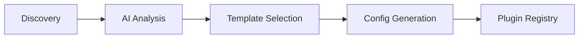

## Quick Example

```bash
# Install globally
pnpm add -g @nirholas/lyra-tool-discovery

# Set up AI provider
export ANTHROPIC_API_KEY="sk-ant-..."

# Discover MCP servers
lyra-discover discover --sources github --limit 10
```

## How It Works



1. **Discovery** - Searches GitHub and npm for MCP servers and tools
2. **Analysis** - AI reads README, package.json, and code structure
3. **Selection** - Determines the best of 8 plugin templates
4. **Generation** - Creates ready-to-use plugin configuration
5. **Integration** - Feeds into plugin.delivery for deployment

## Part of the Plugin Ecosystem

<div class="ecosystem-grid">
  <a href="https://github.com/nirholas/github-to-mcp" class="ecosystem-card">
    <h3>🔄 github-to-mcp</h3>
    <p>Transform GitHub repositories into MCP servers automatically</p>
  </a>
  
  <a href="https://plugin.delivery" class="ecosystem-card">
    <h3>📦 plugin.delivery</h3>
    <p>Plugin registry and delivery platform for SperaxOS</p>
  </a>
  
  <a href="https://github.com/nirholas/SperaxOS" class="ecosystem-card">
    <h3>🖥️ SperaxOS</h3>
    <p>The AI-powered operating system that consumes these plugins</p>
  </a>
</div>

## Supported Templates

| Template | Type | Use Case |
|----------|------|----------|
| `mcp-http` | MCP | Remote MCP servers with HTTP endpoints |
| `mcp-stdio` | MCP | Local npm packages via npx |
| `openapi` | OpenAPI | Existing APIs with OpenAPI specs |
| `standalone` | React | Interactive dashboards and UIs |
| `markdown` | Markdown | Rich formatted output |
| `basic` | Default | Simple API endpoints |
| `default` | Default | Configurable plugins with settings |
| `settings` | Default | User preference storage |

---

<div style="text-align: center; margin-top: 2rem;">
  <a href="/guide/getting-started" style="display: inline-block; padding: 0.75rem 1.5rem; background: var(--vp-c-brand-1); color: white; border-radius: 8px; text-decoration: none; font-weight: 600;">
    Get Started →
  </a>
</div>
